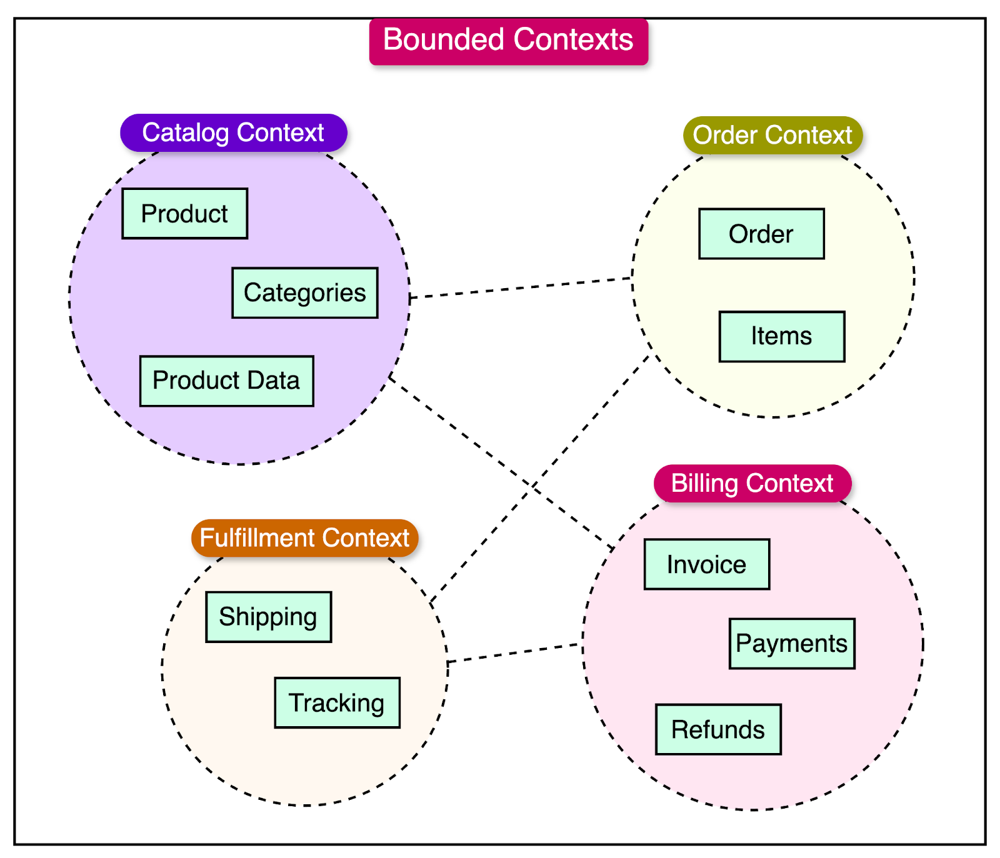
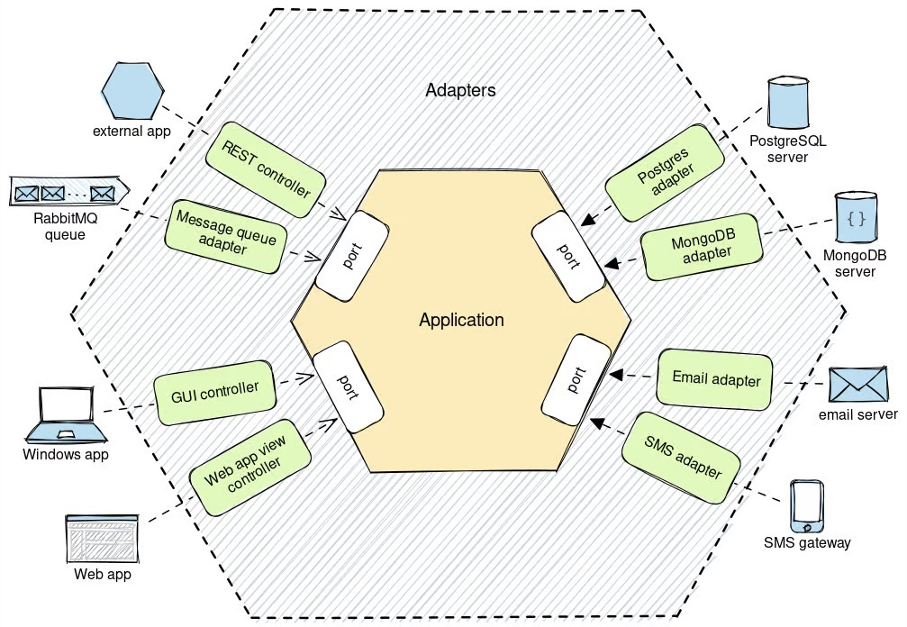

# Ejemplo de microservicio diseñado con DDD y Arquitectura Hexagonal en Spring Boot

En el desarrollo de software moderno, la capacidad de adaptarse a requerimientos cambiantes y de mantener un alto grado
de calidad y escalabilidad es fundamental. Para ello, han surgido diversos enfoques que buscan centrar el diseño en la
lógica del negocio y en la modularidad de los sistemas. Entre estos, el **Domain-Driven Design (DDD)** se enfoca en
modelar
el dominio con precisión mediante un lenguaje ubicuo y la definición de contextos limitados, mientras que la
**Arquitectura Hexagonal** propone aislar el núcleo de la aplicación de las dependencias externas a través de puertos y
adaptadores. Por último, la arquitectura basada en microservicios fragmenta el sistema en servicios autónomos que pueden
desarrollarse, desplegarse y escalarse de forma independiente. La integración de estos enfoques permite construir
sistemas robustos, mantenibles y alineados con los procesos del negocio.

## Domain-Driven Design (DDD)

El Domain-Driven Design (DDD) es un enfoque de desarrollo de software que se centra en modelar la complejidad del
dominio de negocio de manera explícita y colaborativa. Se basa en la idea de que, para crear sistemas que resuelvan
problemas reales de una organización, es fundamental comprender profundamente el negocio y plasmar ese entendimiento en
el software, a través de un modelo que se construya en conjunto con expertos en la materia.

### Principios Fundamentales de DDD

#### Lenguaje Ubicuo

Uno de los pilares del DDD es el **lenguaje ubicuo**. Se trata de establecer un vocabulario compartido entre
desarrolladores y expertos del dominio para describir de manera precisa los conceptos, procesos y reglas del negocio.
Esta práctica reduce la ambigüedad y garantiza que tanto el código como la documentación reflejen la misma visión del
dominio, lo cual es esencial para evitar malentendidos y errores de interpretación.

#### Contextos Limitados (Bounded Contexts)

El concepto de **contextos limitados** implica dividir el dominio en áreas específicas donde un modelo es válido y
consistente. Cada bounded context tiene sus propias reglas, entidades y lenguaje, lo que permite que diferentes partes
del sistema puedan evolucionar de forma independiente. Esta separación es vital para gestionar la complejidad y para
definir límites claros entre distintas áreas de negocio.

#### Modelado del Dominio

El proceso de modelado en DDD busca capturar de forma precisa las reglas y procesos del negocio. Para ello, se utilizan
varios patrones y elementos:

- **Entidades:** Son objetos que poseen una identidad única y un ciclo de vida propio.
- **Objetos de Valor:** Representan conceptos del dominio que son inmutables y se definen únicamente por sus atributos.
- **Agregados:** Son agrupaciones de entidades y objetos de valor que se tratan como una única unidad para garantizar la
  consistencia de las operaciones.
- **Repositorios y Servicios de Dominio:** Facilitan la persistencia y la aplicación de las reglas del negocio,
  permitiendo que la lógica se mantenga aislada de detalles técnicos.

## Arquitectura Hexagonal

La Arquitectura Hexagonal, también conocida como Ports and Adapters, fue propuesta por Alistair Cockburn como una forma
de desacoplar la lógica de negocio de las preocupaciones técnicas y de infraestructura. Su idea fundamental es que el
núcleo del sistema (el dominio) debe estar aislado de los detalles externos mediante:

- **Puertos**: Interfaces abstractas que definen cómo el dominio interactúa con el exterior.
- **Adaptadores**: Implementaciones concretas de estos puertos, responsables de conectar el dominio con tecnologías como
  bases de datos, interfaces de usuario o sistemas externos.

Esta organización garantiza que los cambios en la infraestructura no afecten la lógica central y permite una mayor
testabilidad y flexibilidad en el desarrollo.

## Microservicios y su relación con DDD y la Arquitectura Hexagonal

La arquitectura de microservicios consiste en dividir una aplicación en servicios pequeños, autónomos y desplegables de
forma independiente. Cada microservicio se centra en una parte específica del negocio y se comunica con otros mediante
APIs bien definidas.

### Alineación de Bounded Contexts y Microservicios

Una de las sinergias más importantes entre DDD y los microservicios es la identificación de bounded contexts. **Cada
microservicio puede ser visto como la implementación de un contexto limitado del dominio**, lo que permite que el modelo
de negocio se mantenga coherente y aislado en cada servicio. Así, cada microservicio posee su propio modelo, diseñado
según los principios del DDD, lo que facilita el desarrollo y la evolución independiente de cada componente del sistema.

### Uso de la Arquitectura Hexagonal en Microservicios

Integrar la Arquitectura Hexagonal en microservicios refuerza aún más el desacoplamiento. Cada microservicio, al aplicar
un diseño hexagonal, aisla su lógica de negocio (núcleo) de los detalles tecnológicos mediante puertos y adaptadores.
Esto permite que, por ejemplo, un microservicio que gestiona pagos pueda cambiar su mecanismo de persistencia o la forma
de comunicarse con sistemas externos sin afectar la lógica central del pago.

En otras palabras:

- Arquitectura de Microservicios: DDD ayuda a definir los límites del servicio en función de contextos delimitados.
- Arquitectura Hexagonal: Esta estructura de paquetes es bastante amigable con DDD por naturaleza, proporcionando intrínsecamente una
  separación clara de preocupaciones.

Este código está basado del siguiente repositorio [GitHub](https://github.com/nkchauhan003/order-service/tree/main).